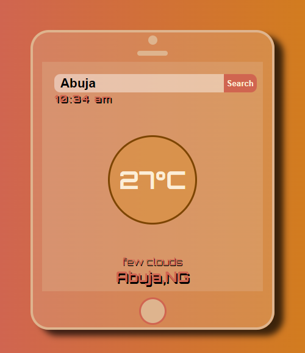

## Table of contents

- [Overview](#overview)
  - [The challenge](#the-challenge)
  - [Screenshot](#screenshot)
  - [Links](#links)
- [My process](#my-process)
  - [Built with](#built-with)
  - [What I learned](#what-i-learned)
  - [Continued development](#continued-development)
  - [Useful resources](#useful-resources)
- [Author](#author)
- [Acknowledgments](#acknowledgments)
## Overview
A testimonial page implemented using css grid
### The challenge

Users should be able to:

- View the optimal layout for the site depending on their device's screen size

### Screenshot

### Links

- Solution URL: [Add solution URL here](https://github.com/hebrohim/weatherApp)
- Live Site URL: [Add live site URL here](https://hebrohimweatherapp.netlify.app/)

## My process

### Built with

- Semantic HTML5 markup
- CSS custom properties
- CSS Grid
- Mobile-first workflow
### What I learned

I learnt how to use grid in css effectively. compare to flexbox, i was able to make changes to my rows and columns at the same time making use of properties like 
-grid area
-grid gap
-grid-template-row
-grid-template-column

### Continued development

i still want to improve more on my mobile-first approach for designing.with the help of grid system in css i was able to design this project with the mobile first technique. I hope to use bootstrsp or tailwind Css for my next project

### Useful resources

- [Example resource 1](https://www.w3schools.com/css/css_grid.asp) - This helped me when i got stuck while using my grid-area
 
## Author

- Website -(https://hebrohim.github.io/TestimonialPageGridCss/)
- Frontend Mentor -(https://www.frontendmentor.io/profile/hebrohim)

## Acknowledgments
After teaching my student flexbox and grid system in css, i thought of a good project we could implement with grid system, I quickly designed this project and allow them work on it too. 